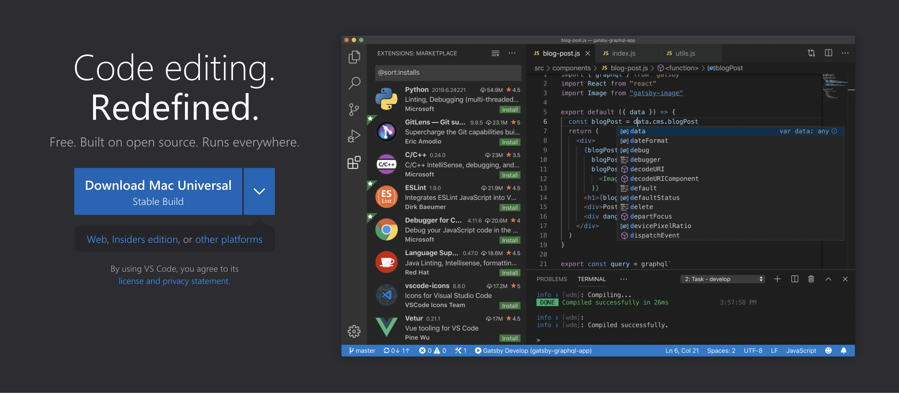
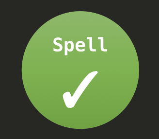

- [1. 🔽 Set up](#1--set-up)
- [2. Download GitHub Desktop](#2-download-github-desktop)
- [3. Download VS Code](#3-download-vs-code)
- [4. Install VS Code Extensions](#4-install-vs-code-extensions)
  - [4.1. Install Markdown All In One](#41-install-markdown-all-in-one)
  - [4.2. Install :emojisense:](#42-install-emojisense)
  - [4.3. Install Code Spell Checker](#43-install-code-spell-checker)
- [5. :arrow_right: NEXT: Contributing to Open Source](#5-arrow_right-next-contributing-to-open-source)

 ⬅️ [**BACK to README**](README.md)

## 1. 🔽 Set up

Let's get everything we will need installed and set up. 

## 2. Download GitHub Desktop

[GitHub Desktop](https://desktop.github.com/) helps you focus on what matters instead of fighting git.

- Go to [desktop.github.com](https://desktop.github.com/)
- Click "Download for macOS"
- Open the downloaded file
- Follow the installation instructions

## 3. Download VS Code

[VS Code](https://code.visualstudio.com/) (or Visual Studio Code) is a popular code editing tool.

- Go to [code.visualstudio.com](https://code.visualstudio.com/)
- Click "Download Mac Universal"
- Open the downloaded file
- Follow the installation instructions

## 4. Install VS Code Extensions

VS Code extensions allow you customize your editor and gives you a [marketplace](https://marketplace.visualstudio.com/) of options.

### 4.1. Install Markdown All In One

- Open VS Code
- On the far left side, hover over the icon and look for "Extensions." The icon looks like: 
 
- In the search bar, type "markdown all in one"
- Click on `Markdown All in One` with the following icon:
 
- Click "Install"

### 4.2. Install :emojisense:

- Open VS Code
- On the far left side, hover over the icon and look for "Extensions." The icon looks like: 
 
- In the search bar, type "emojisense"
- Click on `:emojisense:` with the following icon:
 
- Click "Install"

### 4.3. Install Code Spell Checker

- Open VS Code
- On the far left side, hover over the icon and look for "Extensions." The icon looks like: 
 
- In the search bar, type "emojisense"
- Click on `Code Spell Checker` with the following icon:
 
- Click "Install"

 ## 5. :arrow_right: [NEXT: Contributing to Open Source](2-contribute.md)

 Now for the fun stuff! Let's [contribute to open source](2-contribute.md)!
