- [1. ⬇️ Download this repository](#1-️-download-this-repository)
- [2. 🌳 Create a branch](#2--create-a-branch)
- [3. 📝 Create a markdown file](#3--create-a-markdown-file)

 ⬅️ [**Back to Set Up**](1-set-up.md)

 ## 1. ⬇️ Download this repository

 First, we need to download or [`clone`](https://docs.github.com/en/repositories/creating-and-managing-repositories/cloning-a-repository) as it's called in `git speak`, this repository.

 For more details, [follow the instructions in the GitHub Docs.](https://docs.github.com/en/desktop/contributing-and-collaborating-using-github-desktop/adding-and-cloning-repositories/cloning-a-repository-from-github-to-github-desktop)

 - Go to [github.com/desktop/desktop-markdown-training](https://github.com/desktop/desktop-markdown-training)
 - Click `<> Code`
 - Click `Open with GitHub Desktop`

- When GitHub Desktop opens, click `Clone`

## 2. 🌳 Create a branch

- In the top navigation bar, click `Current Branch: main`
- Click on the `Branches` tab if you aren't already there
- Click on `New Branch`
   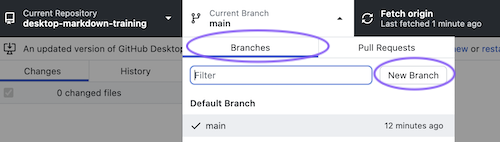
- Name your branch: `githubhandle-contribution`
 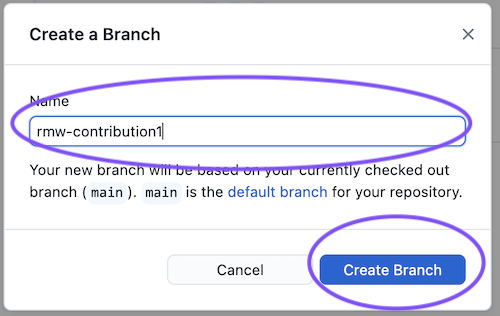
- Now you are on you're new branch! 🎉
- Click `Publish Branch` to save your branch to github.com
 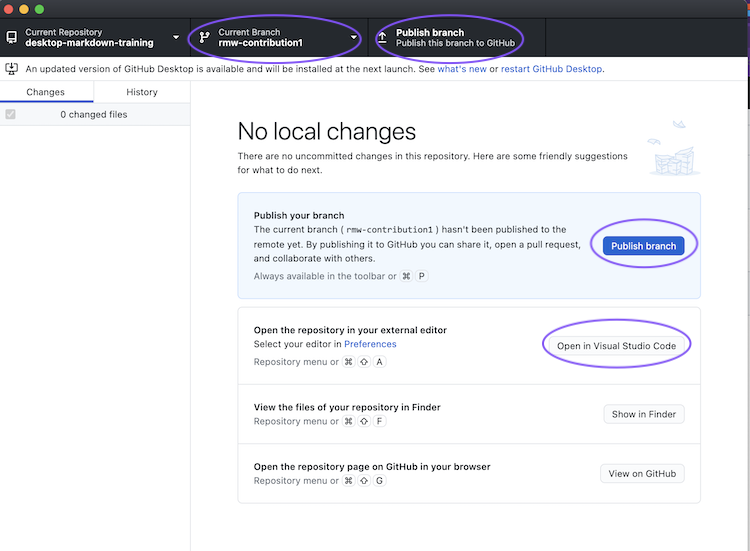
- Click on `Open the repository page on GitHub in your browser` and see that our branch to available for everyone
- Click `main` in the repository page on github.com to see the list of all branches
   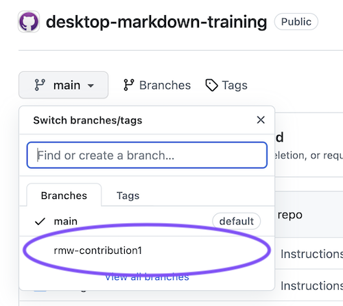

## 3. 📝 Create a markdown file

- From within your branch, click `Open the repository in your external editor`
 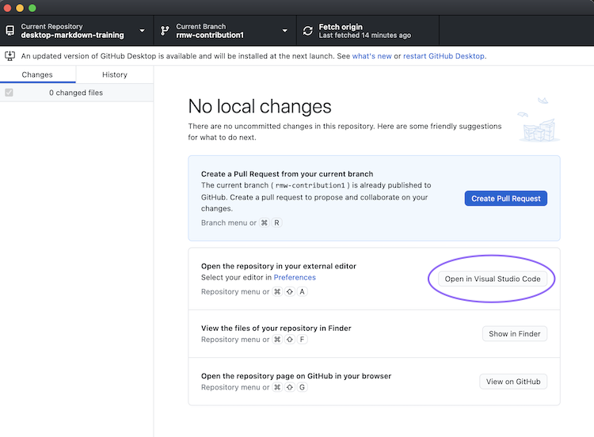
- On the left navigation bar, click the `contributions` folder
   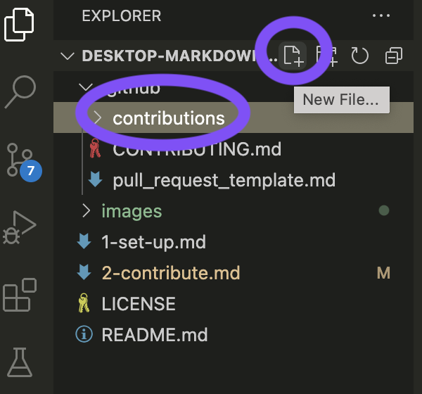
- Then select the new file icon
   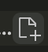
- type `githubhandle.md`
  - for example, my handle is `rmw` so I typed `rmw.md`
  - if your handle is `octocat`, you'd type `octocat.md`
  - ℹ️ The `.md` tells the computer that this is a markdown file!
 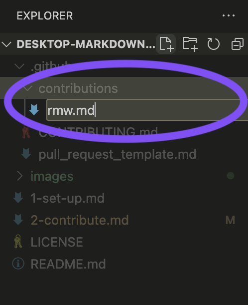
- Click on the file you just created
- Type `# @githubhandle's contribution!`
- Press `command` + `shift` + `v` to show a preview of your markdown file
- In the top navigation bar, click `View` then `Editor Layout` then `Two Columns`
   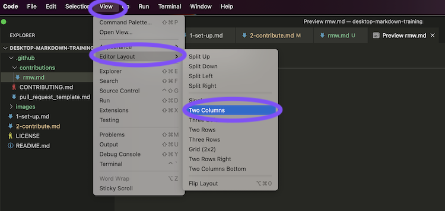
- Drag the tab that starts with `Preview` over to the second column.
 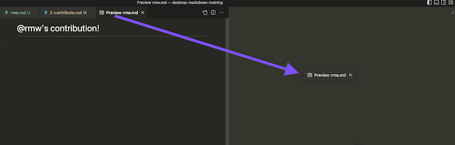
- 🎉 Now we can see our updates as we type them!
 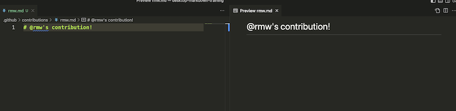
  
  

  

