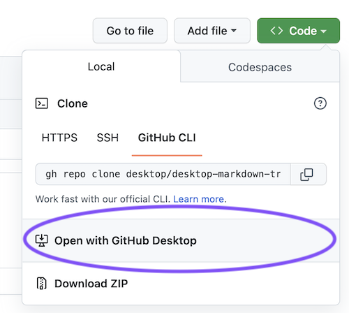
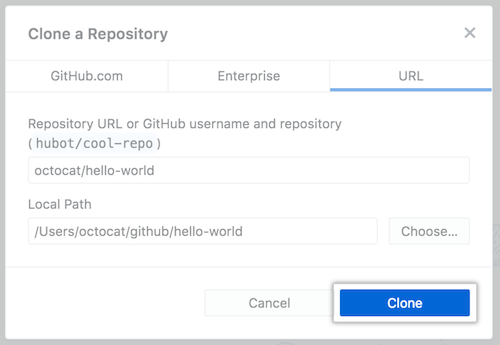

- [⬇️ Download this repository](#️-download-this-repository)

 ⬅️ [**Back to Set Up**](1-set-up.md)

 ## ⬇️ Download this repository

 First, we need to download or [`clone`](https://docs.github.com/en/repositories/creating-and-managing-repositories/cloning-a-repository) as it's called in `git speak`, this repository.

 For more details, [follow the instructions in the GitHub Docs.](https://docs.github.com/en/desktop/contributing-and-collaborating-using-github-desktop/adding-and-cloning-repositories/cloning-a-repository-from-github-to-github-desktop)

 - Go to [github.com/desktop/desktop-markdown-training](https://github.com/desktop/desktop-markdown-training)
 - Click `<> Code`
 - Click `Open with GitHub Desktop`

- When GitHub Desktop opens, click `Clone`

