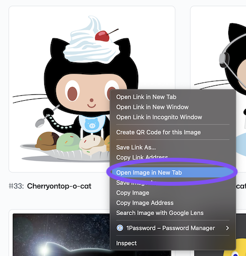
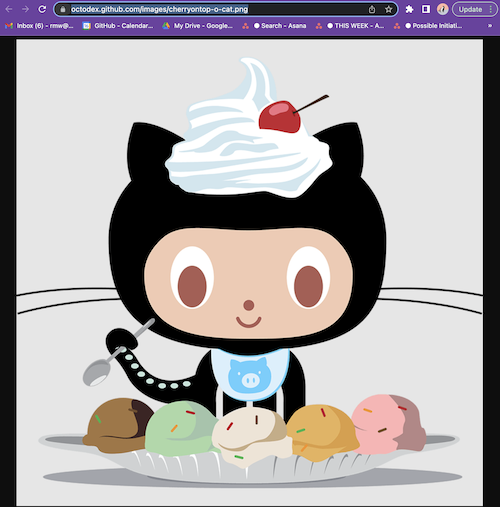
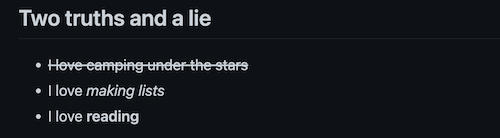
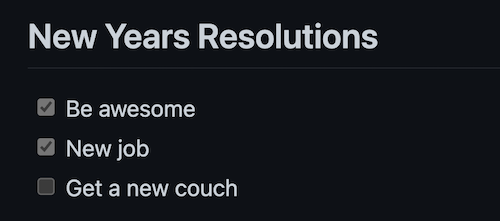
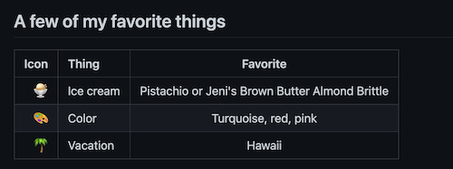
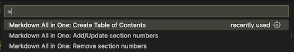
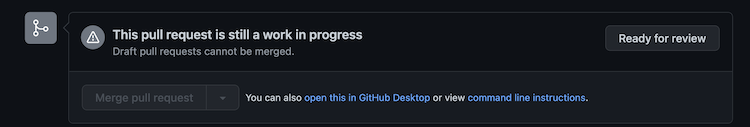
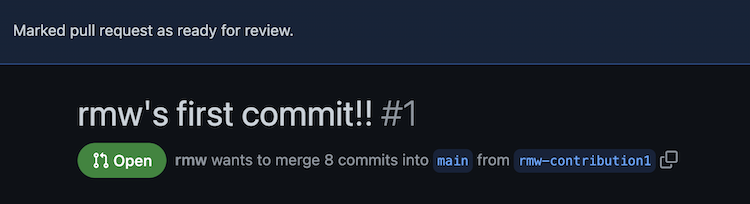
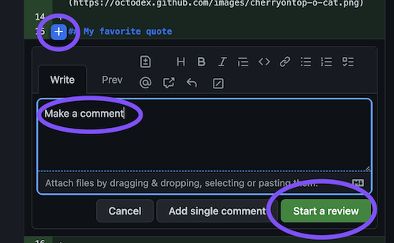
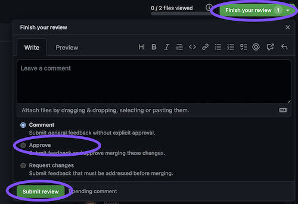

# 3. Fun with Markdown

- [3. Fun with Markdown](#3-fun-with-markdown)
  - [3.1. Markdown resources](#31-markdown-resources)
  - [3.2. Markdown links](#32-markdown-links)
  - [3.3. Markdown headers](#33-markdown-headers)
  - [3.4. Markdown Images](#34-markdown-images)
  - [3.5. Commit your Octocat](#35-commit-your-octocat)
  - [3.6. Markdown quotes](#36-markdown-quotes)
  - [3.7. Lists and formatting with Markdown](#37-lists-and-formatting-with-markdown)
    - [3.7.1. Basic bullets](#371-basic-bullets)
    - [3.7.2. Basic formatting](#372-basic-formatting)
  - [3.8. Numbered lists](#38-numbered-lists)
  - [3.9. Task lists](#39-task-lists)
  - [3.10. Creating tables](#310-creating-tables)
  - [3.11. Add a table of contents](#311-add-a-table-of-contents)
  - [3.12. Commit your Changes](#312-commit-your-changes)
  - [3.13. Make your pull request](#313-make-your-pull-request)
  - [3.14. Get a code review!](#314-get-a-code-review)
- [4. Congratulations! You did it!](#4-congratulations-you-did-it)
 ⬅️ [**Back to Contribute**](2-contribute.md)

## 3.1. Markdown resources

- [Quickstart guide to writing on GitHub](https://docs.github.com/en/get-started/writing-on-github/getting-started-with-writing-and-formatting-on-github/quickstart-for-writing-on-github)
- [Basic writing and formatting syntax](https://docs.github.com/en/get-started/writing-on-github/getting-started-with-writing-and-formatting-on-github/basic-writing-and-formatting-syntax)
- [Markdown Guide](https://www.markdownguide.org/getting-started/)
- [Markdown All In One documentation](https://markdown-all-in-one.github.io/docs/guide/#features)

## 3.2. Markdown links

Let's link your GitHub handle in the header of your markdown file.

Go to your github profile. The url will look something like `https://github.com/yourgithubhandle`. For example, mine is `https://github.com/rmw`

- Go to your github profile and copy the url
- In your markdown file, select your github handle
- Pressing `command` + `v` to paste the url on to the text to create a link

Once done, this will look like

```
# [@rmw](https://github.com/rmw)'s contributions!
```

## 3.3. Markdown headers

In the [last section](2-contribute.md), we created a markdown file and added a [header](https://docs.github.com/en/get-started/writing-on-github/getting-started-with-writing-and-formatting-on-github/basic-writing-and-formatting-syntax#headings).

How, you ask? 

We added `#` in front of text.

The more `#` we add in a row, the smaller the header size. So `##` is smaller than `#`.

Let's add a secondary header to our markdown file. Below your first title, type:

```
## My favorite Octocat
```

## 3.4. Markdown Images

Who doesn't love Ocotcats? Let's find out favorite.

- Got to the [octodex](https://octodex.github.com/)
- Find your favorite Octocat
- Right-click on the image
- Select "Open image in new tab"
<br />
- Copy the URL of the new tab that was opened
<br />

Now below the header we just added, let's add an image. Replace the URL with the one you just copied.

```
## My favorite Octocat


```

## 3.5. Commit your Octocat

- Go to GitHub Desktop
- Add a commit message, such as "Added my favorite Octocat"
- Click the `Commit` button
- Click `Push origin`
- Click `View on github`
- Once in the browser, click on `Pull requests`
- Find and click on your pull request
- Click on `Commits`
- See that your latest commit is in your pull request!

## 3.6. Markdown quotes

Starting a line with `>` will indent quotes.

Let's add your favorite quote to your file.

It'll look something like:


```
## My favorite quote

> Life goes on. The pain of it so sure; the sweetness so mysterious.

-- Alice Walker
```

## 3.7. Lists and formatting with Markdown

Have you ever played that ice breaker game `Two Truths and a Lie`? Basically, you write down three things about yourself. Two of them are true and one is a lie. Then people guess which is the lie.

Let's make a list of our two truths and a lie.

### 3.7.1. Basic bullets

Using `-` we can make a list of items in Markdown.

```
## Two truths and a lie

- I love camping 
- I love making lists
- I love reading
```

### 3.7.2. Basic formatting

Pick your favorite item and let's **bold it**. Because we are using the `Markdown All In One` extension, you can just highlight the text and select `command` + `b`.

```
## Two truths and a lie

- I love camping 
- I love making lists
- I love **reading**
```

For your second favorite item, let's make it italic. You can surround the text with `_` to make something italic.

```
## Two truths and a lie

- I love camping
- I love _making lists_
- I love **reading**
```

Now let's strikeout our lie by surround the text with `~~`

```
## Two truths and a lie

- ~~I love camping under the stars~~
- I love _making lists_
- I love **reading**
```



## 3.8. Numbered lists

As you'd probably expect, you can just start a list with a number and make an ordered list.

List out your top three breakfast items or any other category you choose.

```

## My top three breakfasts

1. Cheese, crackers, and grapes
2. Hard boiled eggs, carrots, and hummus
3. Oatmeal with pecans and blueberries
```

## 3.9. Task lists

GitHub has task or to-do lists build into it's Markdown. You can create these lists by starting each line with `- [ ]`. When the task if complete, you can mark it as done by adding an x: `-[x]`.

Markdown All In One knows how to make and display these lists.

Go ahead and share your new years resolutions or any other task list you'd like.

```
## New Years Resolutions

- [x] Be awesome
- [x] New job
- [ ] Get a new couch 
```


## 3.10. Creating tables

Markdown has a simple table format.

The header columns for the table need to be surrounded by `|`. For example:

`| Icon | Thing | Favorite |`

Then you need to have a special line after the head row. Each column should just have `--`

`| -- | -- | -- |`

You can also specify the alignment or centering of the text in this special row. If you want the text to be left aligned, it would look like `| :-- |`. If you want the text right aligned, it would look like `| --: |`. If you want it centered, it would look like `| :--: |`

Once you have those two rows, you can start adding the items to your table with each column surrounded by `|`.

An example table could look like:

```
## A few of my favorite things

| Icon | Thing | Favorite |
| --: | :-- | :--: |
| 🍨 | Ice cream | Pistachio or Jeni's Brown Butter Almond Brittle |
| :art: | Color | Turquoise, red, pink  |
| 🌴 | Vacation  | Hawaii |
```

These tables can be a little bit hard to read when all the text is jumbled together. Because we are using Markdown All In One, we can press `option` + `shift` + `f` to format the table so all the columns align.

```
## A few of my favorite things

|  Icon | Thing     |                    Favorite                     |
| ----: | :-------- | :---------------------------------------------: |
|     🍨 | Ice cream | Pistachio or Jeni's Brown Butter Almond Brittle |
| :art: | Color     |              Turquoise, red, pink               |
|     🌴 | Vacation  |                     Hawaii                      |
```



## 3.11. Add a table of contents

Markdown All In One helps us make a table of contents! And it will keep it up to date over time.

Go to the top, just under the first header.

Press `command` + `shift` + `p` and select `Markdown All In One: Create Table of Contents`.



## 3.12. Commit your Changes

- Go to GitHub Desktop
- Add a commit message, such as "Added my favorite Octocat"
- Click the `Commit` button
- Click `Push origin`
- Click `View on github`
- Once in the browser, click on `Pull requests`
- Find and click on your pull request
- Click on `Commits`
- See that your latest commit is in your pull request!

## 3.13. Make your pull request

- On github.com on your pull request, scroll down to where it says `This pull request is still a work in progress`
<br />
- Click `Ready for review`
<br />
- In the Pull request description, click `Edit` in the upper left
- Fill in the rest of the fields
  - What did you learn?
  - What went well?
  - What could we do better for next time?
- Click `Update comment`

## 3.14. Get a code review!

We will break into zoom rooms and you and your pair will each code review each others changes.

- Go into the other person's pull request
- Go to `Files changed`
- Review the changes
- Leave a comment by clicking the `+` next to the line you want to comment on 
  - you can use your markdown skilz here!
  <br />
- In the upper right, click `Submit review` or `Finish your review`
- Select `Approve`
- Click `Submit review`
<br />

🎉 🥳 🎉 🥳 🎉 🥳 🎉 🥳 🎉 🥳 🎉 🥳 🎉 🥳 🎉 🥳 🎉 🥳 

# 4. Congratulations! You did it!

🎉 🥳 🎉 🥳 🎉 🥳 🎉 🥳 🎉 🥳 🎉 🥳 🎉 🥳 🎉 🥳 🎉 🥳 


